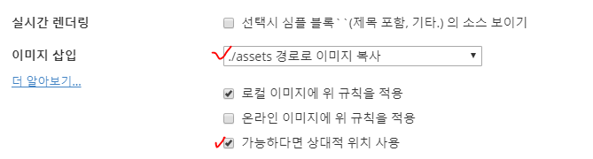

#### 20190729(월) html

1. 크롬 확장 프로그램

   1. web developer 확장 프로그램에 추가

   2. information 

   3. view document outline

2. it기업 기술 볼 수 있는 프로그램, 사이트

   - wappalyzer chrome 
     (웹브라우져가 어떤 기술로 만들어져있는지 알려주는 프로그램)

   - Stackshare: https://stackshare.io/: 어떤 기업들이 어떤 프로그램을 사용하고있는지 보여주는 사이트

3. html 사이트

   - w3shcool: https://docs.python.org/ko/3/tutorial/index.html

   - MDN web docs :https://developer.mozilla.org/ko/

   

4. 마크타운 이미지 넣기

   

5. codecademy 

   html css 문제 연습하세요