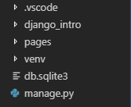

### 장고를 위한 특별한 환경 만들기

다른 프로그램들은 없고 장고만 있는 환경을 만들어야한다.

왜? 웹서버의 다른 프로그램 의존성을 없애기 위해서!

하나의 프로그램은 최대한 다른 프로그램으로부터 독립적인 것으로 만든다!

불필요한 모듈은 모두 없애고 사용하기 위해!

#### step1

```bash
student@DESKTOP MINGW64 ~
$ mkdir django

student@DESKTOP MINGW64 ~
$ cd django/

student@DESKTOP MINGW64 ~/django
$ mkdir 01_django_intro

student@DESKTOP MINGW64 ~/django
$ cd 01_django_intro/

student@DESKTOP MINGW64 ~/django/01_django_intro
$ ls

student@DESKTOP MINGW64 ~/django/01_django_intro
$ python -m venv venv

student@DESKTOP MINGW64 ~/django/01_django_intro
$ ls
venv/

student@DESKTOP MINGW64 ~/django/01_django_intro
$ cd venv/

student@DESKTOP MINGW64 ~/django/01_django_intro/venv
$ ls
Include/  Lib/  pyvenv.cfg  Scripts/

student@DESKTOP MINGW64 ~/django/01_django_intro/venv
$ cd ..

student@DESKTOP MINGW64 ~/django/01_django_intro
$ source venv/Scripts/activate
(venv)
student@DESKTOP MINGW64 ~/django/01_django_intro
$ cd ..
(venv)
student@DESKTOP MINGW64 ~/django
$ cd 01_django_intro/
(venv)
student@DESKTOP MINGW64 ~/django/01_django_intro
$ pip list
Package    Version
---------- -------
pip        19.0.3
setuptools 40.8.0
You are using pip version 19.0.3, however version 19.2.1 is available.
You should consider upgrading via the 'python -m pip install --upgrade pip' command.
(venv)

```

아무것도 설치가 안되있다. django_intro 안에서는 새로운 환경을 설정한것이다.

이 설정을 해제하기 위해서는

```bash
student@DESKTOP MINGW64 ~/django/01_django_intro
$ deactivate
```

다시 설정하려면

```bash
student@DESKTOP MINGW64 ~/django/01_django_intro
$ source venv/Scripts/activate
(venv)
```


#### step 2

vscode에서 설정하기

원하는 파일에서 vscode 실행

F1 --> Python: Select Interpreter --> ('venv':venv) --> 터미널 창 껏다가 다시 키기


vscode를 껏다가 키면 다시 설정해줘야한다

```bash
student@DESKTOP MINGW64 ~/django/01_django_intro
$ python -V
Python 3.7.3
(venv)
student@DESKTOP MINGW64 ~/django/01_django_intro
$ pip list
Package    Version
---------- -------
pip        19.0.3
setuptools 40.8.0
You are using pip version 19.0.3, however version 19.2.1 is available.
You should consider upgrading via the 'python -m pip install --upgrade pip' command.
(venv)
```

결과가 이렇게 나오면 ok

```bash
student@DESKTOP MINGW64 ~/django/01_django_intro
$ pip install django
```

```bash
student@DESKTOP MINGW64 ~/django/01_django_intro
$ django-admin startproject django_intro .
(venv)
student@DESKTOP MINGW64 ~/django/01_django_intro
$ python manage.py runserver
```

서버를 실행하는 코드: 자주 쓰일거에요!

```bash
student@DESKTOP MINGW64 ~/django/01_django_intro
$ python manage.py runserver
```


##### <app 만들기>

이거슨... pages를 만드는 코드인데 이걸 만들어야 views등등이 자동으로 생성된다.
.html 문서 in templates 폴더(폴더 이름은 반드시 templates여야한다.) in pages

```bash
student@DESKTOP MINGW64 ~/django/01_django_intro
$ django-admin startapp your_app_name
(venv)
$ django-admin startapp pages
(venv)
```

django_intro에서 settings에 install_apps에 pages를 추가해준다.




##### <page 가져오는 흐름>

urls.py --> views.py --templates(html) 순서로 파일을 불러온다.

1. ulrs.py: path 작성해준다.

   ```python
   path('html이름/', views.함수이름)
   path('image/', views.image)
   ```

2. views.py

   ```python
   def 함수이름(request):
       전달할 변수이름 = {
           'key': value,
       }
       return render(request, 'html이름.html', 전달할 변수이름)
   
   def image(request):
       url = {
           'url' : 'https://picsum.photos/300/400',
       }
       return render(request, 'image.html', url)
   ```

3. template(html)

   

   
   
   
   
   
   
   ### 처음부터 다시!
   
   1. git-bash에서 
   
   ```bash
   student@DESKTOP MINGW64 /
   $ cd ~
   
   student@DESKTOP MINGW64 ~
   $ cd django/
   
   student@DESKTOP MINGW64 ~/django (master)
   $ mkdir 02_django_advanced
   
   student@DESKTOP MINGW64 ~/django (master)
   $ cd 02_django_advanced/
   
   student@DESKTOP MINGW64 ~/django/02_django_advanced (master)
   $ python -m venv venv
   
   student@DESKTOP MINGW64 ~/django/02_django_advanced (master)
   $ source venv/Scripts/activate
   (venv)
   student@DESKTOP MINGW64 ~/django/02_django_advanced (master)
   $ pip install django
   
   student@DESKTOP MINGW64 ~/django/02_django_advanced (master)
   $ django-admin startproject django_ad(파일이름) .
   (venv)
   student@DESKTOP MINGW64 ~/django/02_django_advanced (master)
   $ ls
   django_ad/  manage.py*  venv/
   (venv)
   student@DESKTOP MINGW64 ~/django/02_django_advanced (master)
   $ code .
   (venv)
   ```
   
   2. vs code열리면 그 안에서
      F1 --> Python: Select Interpreter --> ('venv':venv) --> 터미널 창 껏다가 다시 키기
   
   
   
   3. 다시 git-bash 에서
   
   ```
   student@DESKTOP MINGW64 ~/django/02_django_advanced (master)
   $ django-admin startapp pages
   (venv)
   
   ```
   
   
   
   gitbash와 vscode의 bash가 서로 공유되지 않기 때문에 설정을 각기 해주어야한다.


### 다시 한 번 새로운 프로젝트 시작

```
1. 환경설정
$ python -m venv venv
```

2. f1 --> python select interpreter --> venv --> 터미널 창 껏다가 키기

3. gitignore생성

```
4. 
$ pip install django

5.프로젝트 시작
$ django-admin startproject board .

6.앱추가
$ django-admin startapp todos
```

