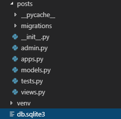
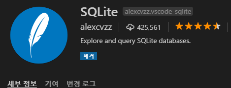

### models.py

CRUD : create read update delete: 데이터로 할 수 있는 모든것

ORM: object(파이썬의 객체지향) relational(SQL의 관계형 데이터베이스) mapping

scheme(틀): 데이터베이스에 무슨 내용이 들어올지 정의하는것(예를 들면 제목, 내용, 글쓴이, 작성날짜.. 이런식으로 나눠서)


#### C: Create

1.

```python
student@DESKTOP MINGW64 ~/django/02_django_advanced (master)
$ python manage.py makemigrations
```

>  파이썬 언어를 데이터베이스의 언어로 번역


2.

```python
student@DESKTOP MINGW64 ~/django/02_django_advanced (master)
$ python manage.py migrate
```

> 번역한 내용을 실제 데이터베이스(SQL)에 저장을 하였다.




> db.sqlite3에 저장됨

 

3.

```python
student@DESKTOP MINGW64 ~/django/02_django_advanced (master)
$ python manage.py shell
```

> 창이 뜨면 python언어로 명령어를 내릴 수 있다.


4. 명령어 내리기

```
student@DESKTOP MINGW64 ~/django/02_django_advanced (master)
$ python manage.py shell
Python 3.7.3 (v3.7.3:ef4ec6ed12, Mar 25 2019, 22:22:05) [MSC v.1916 64 bit (AMD64)] on win32AMD64)] on win32
Type "help", "copyright", "credits" or "license" for more information.
(InteractiveConsole)
>>> from posts.models import Post
>>> Post
<class 'posts.models.Post'>
>>> p = Post()
>>> p
<Post: Post object (None)>
>>> p.title
''
>>> p.title = '안녕하세요'
>>> p.content = '반갑습니다.'
>>> p.title
'안녕하세요'
>>> p.content
'반갑습니다.'
>>>
>>> p
<Post: Post object (None)>
```

> 인스턴스에 타이틀과 컨텐트 저장가능.
>
> <Post: Post object (None)>에서 None은 ID값이 들어가는 자리이다.
>
> 아직 데이터베이스에 저장하지 않았기 때문에 ID가 뜨지 않는다.
>
> 데이터 구분하기 위해서 각자 고유값(ID)을 가진다.
>
> 데이터 베이스에 저장이 되는 순간 ID가 부여된다.

```
<Post: Post object (None)>
>>> p.save()
>>> p
<Post: Post object (1)>
```

>sql에 저장이 되면 None이 아니라 ID가 표시됨


두번째 인스턴스를 생성하고, 두번째 데이터를 저장해보자

```
>>> p2 = Post()
>>> p2
<Post: Post object (None)>
>>> p2.title = '두번째 게시물'
>>> p2.content = '내용 두번쨰'
>>> p2
<Post: Post object (None)>
>>> p2.save()
>>> p2
<Post: Post object (2)>
```

>데이터 베이스에 `p2.save()`를 실행하여 저장할 수 있다.
>
>ID 값으로 2를 가진 데이터로 저장된다.


```py
>>> Post.objects.all()
<QuerySet [<Post: Post object (1)>, <Post: Post object (2)>]>
>>> Post.objects.all()[1]
<Post: Post object (2)>
```

> `Post.objects.all()`로 모든 데이터를 불러올 수 있다.
>
> `QuerySet`은 리스트와 속성이 비슷하여 인덱스 접근이 가능하다.


```python
>>> exit()
```

>  셀 종료하기
>
> 셀을 껏다가 키면 class 를 다시 import 해야함


불편함을 해결하기 위해서 프로그램을 설치해준다

```python
student@DESKTOP MINGW64 ~/django/02_django_advanced (master)
$ pip install django_extensions
```

> 설치 후 settings INSTALLED_APPS에 'django_extensions'을 추가해준다


이렇게 실행하자!

```python
student@DESKTOP MINGW64 ~/django/02_django_advanced (master)
$ python manage.py shell_plus
student@DESKTOP MINGW64 ~/django/02_django_advanced (master)
$ python manage.py shell_plus
```

> $ python manage.py shell 대신 $ python manage.py shell_plus을 실행하자!


#### database explorer 설치

1. SQLite 다운로드



2. F1 --> SQLite: Open Database --> 데이터베이스로 만들어놓은 파일 선택


### R: Read


get: id로 데이터 찾기

```py
>>> Post.objects.get(id=1)
<Post: Post object (1)>
```

> id가 1번인 데이터만 가져온다. id 값이 있는 데이터만 가져올 수 있다.


get: title로 데이터 찾기

```
>>> Post.objects.get(title='안녕하세요')
<Post: Post object (1)>
```

> title이 똑같은게 있으면? filter 이용


```
>>> Post.objects.filter(title='안녕하세요')
<QuerySet [<Post: Post object (1)>]>
```


*id는 중복되는 값이 없으니까 앞으로는 id로 접근할거에요* 


### Update

새로운 게시물은 무조건 뒤에 붙는다.


### Delete